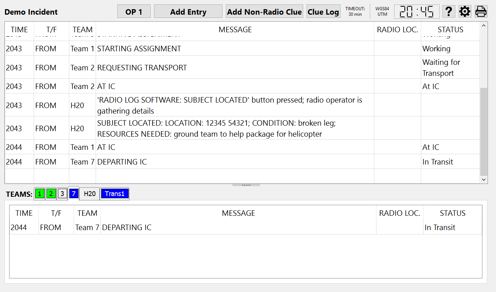
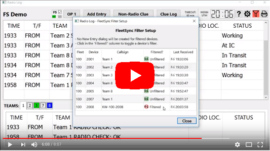
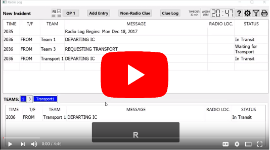

= radiolog

Software that tracks Search and Rescue missions.
Used by the radio operator in the command post.
Logs the status and positions of the field teams over time, as well as any clues they encounter.
The data is saved to the hard drive as plain text (CSV files) for later analysis, and a hard-copy report can be printed at the end of the mission (or sub-missions).

== Introduction

November 2016: This 28-minute screencast video covers the key features.

0:00 -- link:https://www.youtube.com/watch?v=pTk-0i6uYUQ&t=0m0s[Introduction]

1:27 -- link:https://www.youtube.com/watch?v=pTk-0i6uYUQ&t=1m27s[Starting the program]

1:59 -- link:https://www.youtube.com/watch?v=pTk-0i6uYUQ&t=1m59s[Team tabs] (corresponding link:https://www.youtube.com/watch?v=pTk-0i6uYUQ&t=4m9s[demo] is at 4:09)

4:43 -- link:https://www.youtube.com/watch?v=pTk-0i6uYUQ&t=4m43s[Welfare checks] (corresponding link:https://www.youtube.com/watch?v=pTk-0i6uYUQ&t=6m26s[demo] is at 6:26)

7:00 -- link:https://www.youtube.com/watch?v=pTk-0i6uYUQ&t=7m0s[Team status] (corresponding link:https://www.youtube.com/watch?v=pTk-0i6uYUQ&t=8m41s[demo] is at 8:41)

10:56 -- link:https://www.youtube.com/watch?v=pTk-0i6uYUQ&t=10m56s[Clue management] (corresponding link:https://www.youtube.com/watch?v=pTk-0i6uYUQ&t=15m5s[demo] is at 15:05)

16:15 -- link:https://www.youtube.com/watch?v=pTk-0i6uYUQ&t=16m15s['Subject located' button] (corresponding link:https://www.youtube.com/watch?v=pTk-0i6uYUQ&t=16m54s[demo] is at 16:54)

18:02 -- link:https://www.youtube.com/watch?v=pTk-0i6uYUQ&t=18m2s[Kenwood FleetSync interface] (corresponding link:https://www.youtube.com/watch?v=pTk-0i6uYUQ&t=20m53s[SARSoft Locators demo] is at 20:53)

21:58 -- link:https://www.youtube.com/watch?v=pTk-0i6uYUQ&t=21m58s[Message stack] (corresponding link:https://www.youtube.com/watch?v=pTk-0i6uYUQ&t=24m14s[demo] is at 24:14)

24:50 -- link:https://www.youtube.com/watch?v=pTk-0i6uYUQ&t=24m50s[Amending messages]

26:13 -- link:https://www.youtube.com/watch?v=pTk-0i6uYUQ&t=26m13s[Multi-operational-period support]

27:36 -- link:https://www.youtube.com/watch?v=pTk-0i6uYUQ&t=27m36s[Printing]

28:11 -- link:https://www.youtube.com/watch?v=pTk-0i6uYUQ&t=28m11s[Automatic file management]

---

November 2017: Here's an 8-minute link:https://youtu.be/Q786OtFgZDc[Screencast video] on the FleetSync features of Radiolog, including FleetSync muting and selective device filtering.

---

January 2018: Here's a 4-minute summary link:https://youtu.be/J_sFsYn4sbY[screencast video] on using Radiolog without Fleetsync.

---

An overview slideshow (17 slides describing the features in a bit more detail): link:/doc/radiolog_overview.pdf[overview PDF]

FleetSync interface details are spelled out link:/doc/radiolog_fleetsync_details.pdf[here].

Please contact the author if other documentation would be helpful.

== Project Status

This open-source project is mainly intended for use by Search and Rescue teams.
Nevada County Sheriff's Search and Rescue (https://https://www.mynevadacounty.com/258/Search-Rescue) has been using this tool on every callout since early 2015.

June 2020: Red Rock Search and Rescue (https://redrocksar.org) is in the process of adapting it for their use.

== Installation and Getting Started

Unfortunately, this software is not yet in an easily installable state, but creating a clean installer is on the to-do list.  
Until then, please contact us if your team is interested in using this software.

The current installation procedure is link:doc/INSTALL.adoc[here].

== Our Design Philosophy

This software is intended to be user-friendly and intuitive, with no training necessary to make use of key features

- Most features are automated
- Less overhead = reduced fiddling
- Fewer options = reduced fiddling
- Reduced fiddling = a more effective radio operator

== Contributing

Volunteer contributors are welcome to join in.
You do NOT need to be software developer to contribute.
We can always use help with documentation, testing, etc.

The guidelines for contributing to this project are link:doc_technical/CONTRIBUTING.adoc[here].

== Credits

Tom Grundy:: Volunteer - link:https://https://www.mynevadacounty.com/258/Search-Rescue[Nevada County Sheriff's Search and Rescue], Nevada County, California. https://github.com/caver456

Craig Jones:: Volunteer - link:https://redrocksar.org[Red Rock Search and Rescue], Las Vegas, Nevada. https://github.com/polyglot-jones

